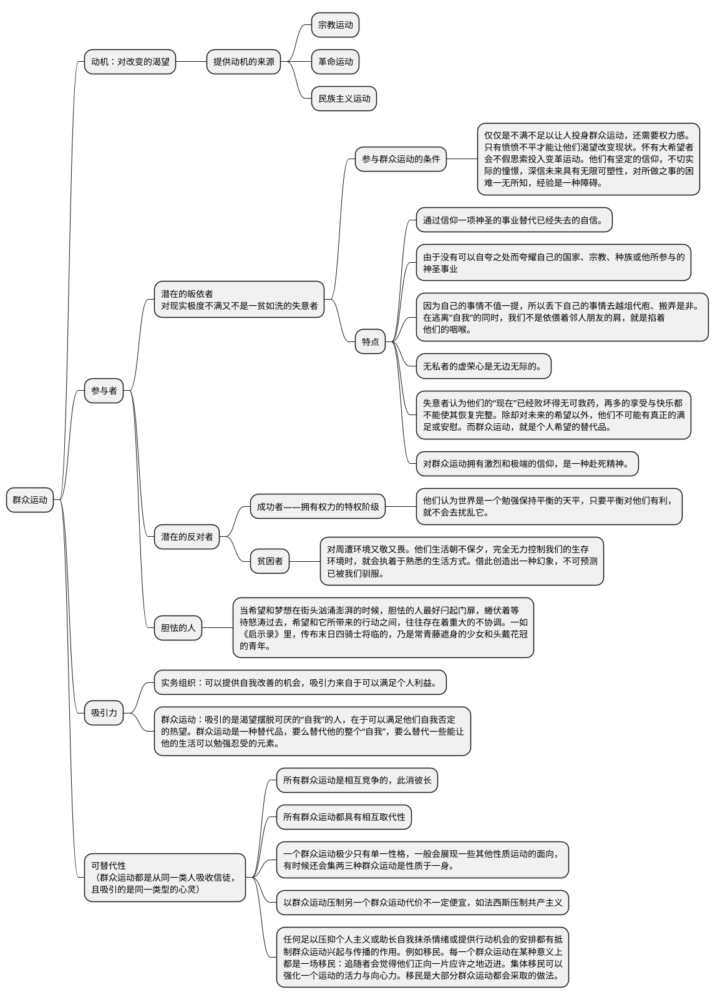

# 狂热分子——群众运动圣经

## 大纲
本书探讨的是群众运动共有的一些特征，不管是宗教运动、社会运动，还是民族主义运动。所有群众活动都会激发起其追随者赴死的决心和团结行动的意愿；不管他们宣扬的主张或制定的纲领为何，所有群众运动都会助长狂热、激情、热望、仇恨和不宽容；所有群众运动都能够从生活的某些部门释放出强大的动能；他们全都要求信徒盲从和一心一意效忠。在各种类型的献身、信仰、全力追求、团结与自我牺牲中，存有某种程度的一致性。

本书探讨的主要是群众运动的积极阶段。这个阶段的群众运动是由“忠实信徒（true believer）”所控制，而所谓的“忠实信徒”，是指具有狂热信仰、准备好随时为一件神圣事业牺牲的人。所有群众运动的初期追随者都以失意者（the frustrated）居多，以及失意者一般都自愿参加群众运动。

# 结构梳理

怀有大希望者可以从最荒谬的来源汲取力量：一个口号、一句话或一枚徽章



```
1. 怀有大希望者可以从最荒谬的来源汲取力量：一个口号，一句话或一枚徽章。
2. 企图改造一个国家或整个世界的人，不可能单靠培养和利用不满情绪成事，单是展示变革的合理性或诉诸强制手段亦不足以为功。他们必须知道怎样在人们心中燃起一个极不切实际的希望，至于这个希望是一个天上的天国，地上的天堂，闻所未闻的财富还是统治世界，都无关宏旨。
3. 当希望和梦想在街头汹涌澎湃的时候，胆怯的人最好闩起门扉、关上窗户，蜷伏着等待怒涛过去，希望和它所带来的行动之间，往往存在着重大的不协调。一如《启示录》里，传布末日四骑士将临的，乃是常青藤遮身的少女和头戴花冠的青年。
4. 觉得自己人生已败坏到无可救药的人，不会认为自我改善是值得追求的目标。他们最深的渴望是过新生活，是重生，要是无法得到这个，他们就会渴望通过认同于一件神圣的事业而获得自豪、信心、希望、目的感和价值感这些他们本来没有的元素。
5. 把自我中心的生活换成无私的生活后，我们会得到的自尊是庞大的。无私者的虚荣心是无边无际的。
6. 在现代社会，人们只有在忙得透不过气的时候，才能够不抱希望地活着。失业者宁愿追随贩卖希望的人，而不愿追随施予救济的人。
7. 所有形式的献身、虔诚、效忠和自我抹杀，本质上都是对一种事物牢牢攀附——攀附着一件可以带给我们渺小人生意义和价值的东西。因此，任何对替代品的拥抱，都必然是激烈和极端的。
8. 我们对自己只能有有限度的信心，但是我们对国家、宗教、种族或神圣事业的信仰，却必定是夸张和不妥协的。
9. 一种被温和拥抱的替代品，是不足以取代和抹杀那个我们想要遗忘的自我的。除非准备好为某种东西而死，我们不会有把握自己过的是有价值的生活。这种赴死精神可以作为一种证据，向自己和别人显示，我们的选择是最好的。
```