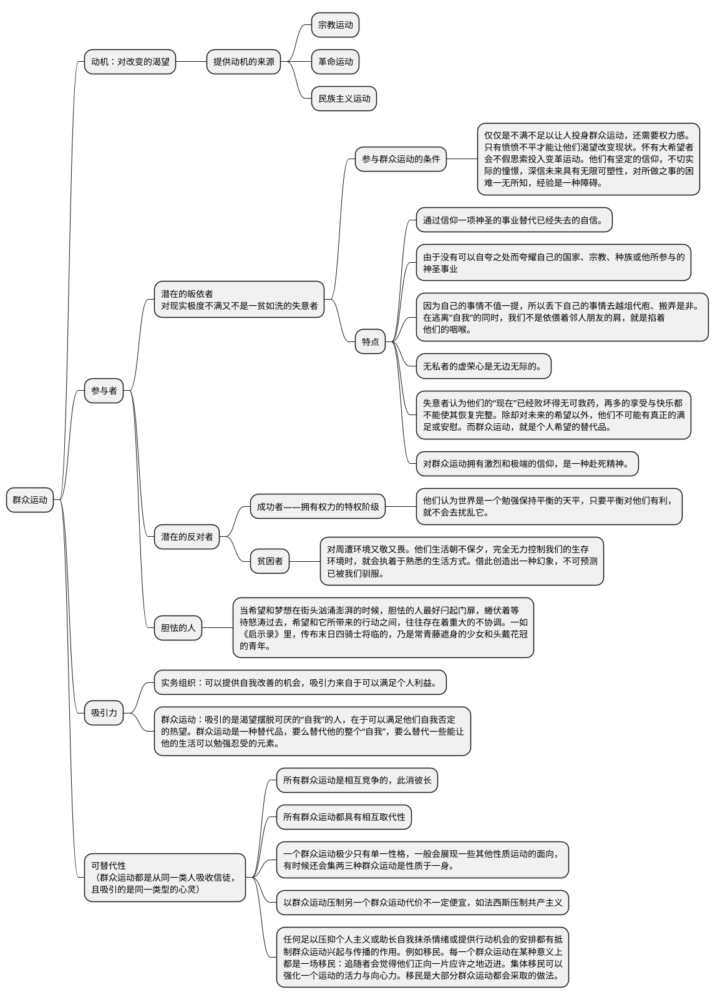
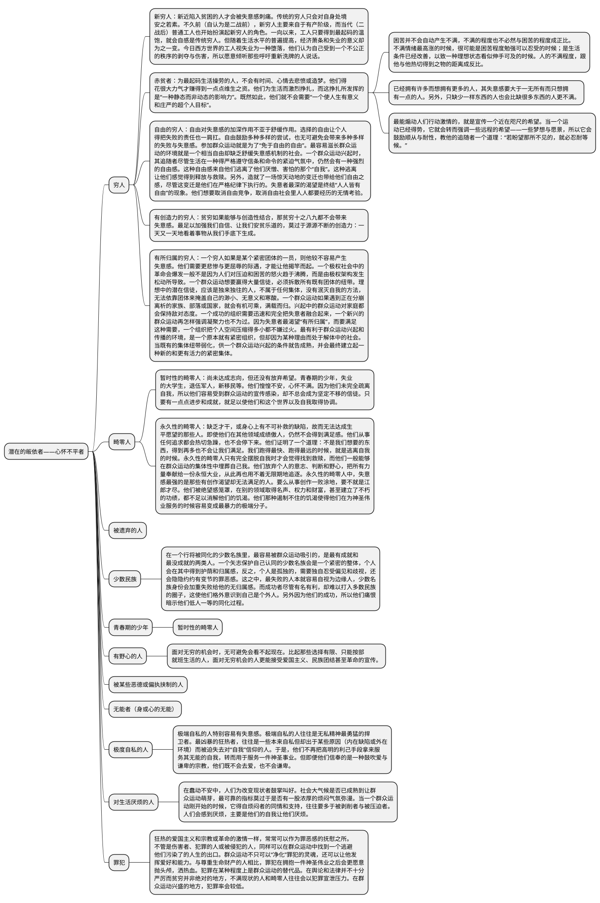

# 狂热分子——群众运动圣经

## 大纲
本书探讨的是群众运动共有的一些特征，不管是宗教运动、社会运动，还是民族主义运动。所有群众活动都会激发起其追随者赴死的决心和团结行动的意愿；不管他们宣扬的主张或制定的纲领为何，所有群众运动都会助长狂热、激情、热望、仇恨和不宽容；所有群众运动都能够从生活的某些部门释放出强大的动能；他们全都要求信徒盲从和一心一意效忠。在各种类型的献身、信仰、全力追求、团结与自我牺牲中，存有某种程度的一致性。

本书探讨的主要是群众运动的积极阶段。这个阶段的群众运动是由“忠实信徒（true believer）”所控制，而所谓的“忠实信徒”，是指具有狂热信仰、准备好随时为一件神圣事业牺牲的人。所有群众运动的初期追随者都以失意者（the frustrated）居多，以及失意者一般都自愿参加群众运动。

# 结构梳理

怀有大希望者可以从最荒谬的来源汲取力量：一个口号、一句话或一枚徽章

---

1. 怀有大希望者可以从最荒谬的来源汲取力量：一个口号，一句话或一枚徽章。
2. 企图改造一个国家或整个世界的人，不可能单靠培养和利用不满情绪成事，单是展示变革的合理性或诉诸强制手段亦不足以为功。他们必须知道怎样在人们心中燃起一个极不切实际的希望，至于这个希望是一个天上的天国，地上的天堂，闻所未闻的财富还是统治世界，都无关宏旨。
3. 当希望和梦想在街头汹涌澎湃的时候，胆怯的人最好闩起门扉、关上窗户，蜷伏着等待怒涛过去，希望和它所带来的行动之间，往往存在着重大的不协调。一如《启示录》里，传布末日四骑士将临的，乃是常青藤遮身的少女和头戴花冠的青年。
4. 觉得自己人生已败坏到无可救药的人，不会认为自我改善是值得追求的目标。他们最深的渴望是过新生活，是重生，要是无法得到这个，他们就会渴望通过认同于一件神圣的事业而获得自豪、信心、希望、目的感和价值感这些他们本来没有的元素。
5. 把自我中心的生活换成无私的生活后，我们会得到的自尊是庞大的。无私者的虚荣心是无边无际的。
6. 在现代社会，人们只有在忙得透不过气的时候，才能够不抱希望地活着。失业者宁愿追随贩卖希望的人，而不愿追随施予救济的人。
7. 所有形式的献身、虔诚、效忠和自我抹杀，本质上都是对一种事物牢牢攀附——攀附着一件可以带给我们渺小人生意义和价值的东西。因此，任何对替代品的拥抱，都必然是激烈和极端的。
8. 我们对自己只能有有限度的信心，但是我们对国家、宗教、种族或神圣事业的信仰，却必定是夸张和不妥协的。
9. 一种被温和拥抱的替代品，是不足以取代和抹杀那个我们想要遗忘的自我的。除非准备好为某种东西而死，我们不会有把握自己过的是有价值的生活。这种赴死精神可以作为一种证据，向自己和别人显示，我们的选择是最好的。
10. 一个群体的性格和命运，往往由其最低劣的成员决定。
11. 历史这个游戏的玩家一般都是社会的最上层和最下层，占大多数的中间层次只有在台下看戏的份。
12. 社会低等成员之所以能对社会发生重大影响，是因为他们对“现在”全不尊重。他们渴望通过某种惊心动魄的集体事业，去掩埋他们已经败坏和了无意义的自我。
13. 一个没有废料和不满者的国家，固然会井然有序、高尚、和平和愉快，但它缺少开拓未来的种子。
14. 会被失意感刺痛的穷人，一般都是新近才陷入贫穷的。美好生活的记忆像火焰般在他们血管里燃烧。他们是失去继承权和遭剥夺的人，每有群众运动出现，就会忙不迭振臂相迎。
15. 为最起码生活操劳的人，不会有时间、心情去悲愤或造梦。
16. 悲愤会在它几乎得到补偿的时候最为蚀骨。
17. 希望可以让一个人不顾一切地行动，也可以训练和培养人的耐性。差别就在于它是一个短程的希望还是远程的希望。
18. 选择的自由让个人得把失败的责任也一肩扛。
19. 狂热者对自由的恐惧尤甚于迫害。
20. 只有当运动过了它的积极阶段，凝固为一些稳定的制度模式后，个人自由才有机会抬头。一个群众运动的积极阶段越短，人们越会觉得早就个人自由是运动本身而不是运动的终结。积极阶段越短，被群众运动推翻和取代的那个极权体制在人们的印象中就越暴虐。
21. 最大声呼吁自由的人，往往是最不乐于住在自由社会里的人。
22. 那些觉得自己生命败坏了和荒废掉的人，会渴望平等与博爱多于渴望自由。
23. 对平等的激情是一种对匿名的激情：想要成为构成一件外衣的众多丝线之一，一根无别于其他丝线的丝线。这样，就没有人会把他指出来，与别人比较，让其低劣无所遁形。
24. 在自由实际存在的地方，平等是大众的热望。在平等实际存在的地方，自由是少数人的热望。有平等而没有自由，会比有自由而没有平等更难创造稳定的社会模式。
25. 一个人越是不把自己看成能够决定自己现状与前途的独立自主个体，就越不会把自己的贫困归因于自己的拙劣。
26. 被统治者融合在一个整体中的程度越深，个人落寞的情绪越少。
27. 一个落后国家想要实现现代化，大概都少不了一个坚强的团体行动架构。
28. 当工人感觉自己是团队的一员，他的生产力将会是最大的。“按个人表现发奖金的鼓励方法总是弊大于利……倒不如按照全体工作成绩表现办法团体奖金，最好是连工头都包括在内……这样做看来更能促进生产力，而工人方面也会更满意。”
29. 个人自由与个人独立是将一个不成熟和准备不足的个人从群体中扯离，把他委之于“在自己无能之下的自由”（the freedom of his own impotence）。今天群众运动蔚然成风，正是人们强烈渴望摆脱无能、无目的感的个人存在所导致的。
30. 一个新兴群众运动赖以吸引和维系追随者的，不是主义与承诺，而是能不能提供给人们一个避难所，让他们可以逃离焦虑、空虚和无意义的生活。它能够治疗严重的失意者，不在于提供一种绝对真理，或是解决他们生活上的困难，而在于能让他们摆脱无能的“自我”。而它之所以能够做到这一点，靠的是把失意者融化到一个紧密无间的集体中。
31. 依主义的真确性和承诺的可实现性去判断一个群众运动的存活能力是徒劳的。真正有效的判断标准是看它的组织能不能迅速和完全把失意者融合起来。
32. 当一个极权社会的人民揭竿而起时，他们要反对的不是它的邪恶，而是它的软弱。（中国的农民起义好像刚好相反）
33. 极端自私的人往往是无私精神最勇猛的捍卫者。最凶暴的狂热者，往往是一些本来自私但却出于某些原因（内在缺陷或外在环境）而被迫失去对“自我”信仰的人。于是，他们不再把高明的利己手段拿来服务其无能的自我，转而用于服务一件神圣事业。但即便他们信奉的是一种鼓吹爱与谦卑的宗教，他们既不会去爱，也不会谦卑。
34. 对于一个蓄意煽动群众运动的人来说，得知全民都有烦闷无聊之感，会比得知全民都饱受经济和政治剥削，更加感到鼓舞。
35. 意识到自己生活贫乏和无意义是人们厌烦感的只要来源。追求享乐和放荡不羁都不是缓和烦闷的有效方法。
36. 爱国主义是歹徒的最后归宿。
37. 悔恨与悲愤都可以驱使人走向同一个方向。
38. 群众运动的宣传手法是唤起信徒一种悔罪罪犯般的情绪与心灵状态。群众运动的策略，是要把一种病传染给人，然后又把自己说成治病的药方。
39. 一个有力的群众运动会培养其追随者的罪恶感。它不但会把人的自主“自我”形容为贫乏和无助的，还会把它说成是罪孽深重。悔罪的方法是抛弃个人的特殊性和独立性，得救的方法是把自我掩埋在团体的神圣一体性中。
40. 所有群众运动都对罪犯宽大为怀，而且对他们热烈招手。